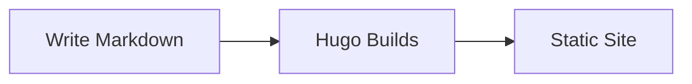

+++
title = "Getting Started"
tags = ["setup", "hugo"]
weight = 1
+++

## Prerequisites

- [Hugo Extended](https://gohugo.io/installation/) (v0.112+)
- [Go](https://go.dev/dl/) (for Hugo modules)
- [Git](https://git-scm.com/)

## Local Development

Start the development server with drafts enabled:

```bash
hugo server -D
```

Open [http://localhost:1313](http://localhost:1313) in your browser.

## Creating Content

### New journal entry

```bash
hugo new notes/YYYY-MM-DD-title.md
```

### New tech doc

```bash
hugo new tech/my-doc.md
```

## Project Structure

```
content/
  _index.md          # Homepage
  notes/             # Journal & personal notes
    _index.md        # Section landing page
  tech/              # Technical documentation
    _index.md        # Section landing page
```

## Useful Shortcodes

### Notice boxes

```markdown
{}
A helpful tip.
{}
```

### Mermaid diagrams

````markdown

````

### Expand/collapse sections

```markdown
{}
Hidden content here.
{}
```
